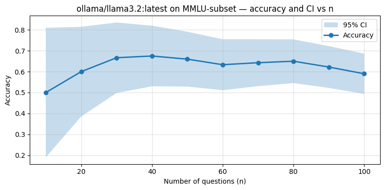

# AI Safety Course of 2026

> 

<!-- Swap the badges for your real values; delete any you don't use. -->

---

## TL;DR

**Why it matters:** provides pipeline for research of LLMs capability and perception

## Key results

- **macro-F1 = [0.79]** 
- Provides statistically rigorous evaluation pipeline that can tell you not just how accurate a model is, but whether observed differences between models are real
- Fully **automated pipeline** to test the performence of two LLMs on benchmarks
- Working agent evaluation pipeline and hands-on experience with the kind of iteration loop used in real-world agent evals.

## Demo

<!-- One good visual beats three paragraphs. Drop a heatmap / index chart / report screenshot here. -->

## Tech stack

`Python 3.11` · `ollama` · `inspect AI`  · `AI Safety`  · `LangChain` 

## Related work

- 📄 Paper: Miller, Evan. Adding Error Bars to Evals: A Statistical Approach to Language Model Evaluations

